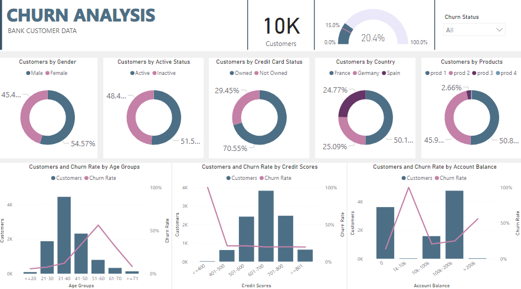

## Bank Customer Churn Analyst
Customer churn is the tendency of customers not to use a particular business or organization. The percentage of customers who stop using the service is called the churn rate.

Using Power BI and the data of a bank, we checked customer churn based on different parameters, which included the following steps:
1. Data Preparation
2. Data Modeling and Analysis
3. Data Visualisation

